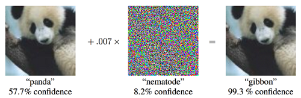
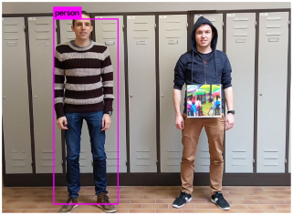
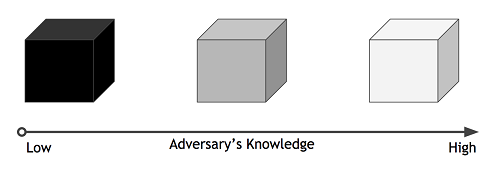

# ML/AI CoP Adversarial Attacks Tutorial

There are many types of adversarial attacks on virtually every system built by humans.  Machine learning is by no means safe from adversarial attacks.  There are many resources for learning about attack types, methods, and defenses including:

* [Wikipedia](https://en.wikipedia.org/wiki/Adversarial_machine_learning)
* [OpenAI](https://openai.com/blog/adversarial-example-research/)
* [Adversarial Robustness Toolbox](https://github.com/Trusted-AI/adversarial-robustness-toolbox)  *\*We'll use this in the tutorial!*
* [DeepMind x UCL Course](https://youtu.be/MhNcWxUs-PQ)
* [NIST Taxonomy and Terminology](https://nvlpubs.nist.gov/nistpubs/ir/2019/NIST.IR.8269-draft.pdf)
* [Google Scholar](scholar.google.com) for many of the original papers.

## What are adversarial attacks/examples?

Put simply, adversarial attacks are inputs to a machine learning model where the expected output seems obvious to a human, but where the model is fooled into an incorrect output.  Examples include injecting words into email to avoid spam filters, adding noise to an image, and adding noise or sounds to audio.  In this tutorial we will be concerned with adversarial attacks on simple models for computer vision.  Here are a few famous examples:

Adding a small amount of noise causes the model to classify a panda as a gibbon. [1](#f1)

Modifying a single pixel causes misclassification.  Correct classes are black, incorrect classes are blue.  [2](#f2)

Adding a sticker caused the MobileEye camera on a Tesla Model S to predict a speed limit of **85** mph.  [3](#f3)

Wearing the right pattern makes a person invisible to a classifier.  [4](#f4)

## Why do we care?

## Taxonomy of attacks

There are a few dimensions upon which adversarial attacks can be classified.  The following are some of them, although the list is neither complete, nor exhaustive.

### Model Access

An attacker can have different levels of access to the model they are attacking.

1. **White Box Attacks**: The attacker has access to the full model.
2. **Black Box Attacks**: The attacker only has access to queries to input into the model and the results.  They do not know the model.
3. **Gray Box Attacks**: The attacker knows what model they are attacking and uses a virtual model and white box attacks.

### Dataset Access

Attacks can be classified by which datasets the attacks are injected into.

1. **Attacks in the Training set**: The attacker injects malicious data into the training set.
2. **Attacks in the Test set**:  The attacker injects malicious data into the test set.

### Targeted vs. Untargeted

Another way to understand adversarial attacks is by whether they are targeted or not.

1. **Untargeted Attacks**:  The goal is for the model to output an incorrect result from the attack input.  It does not matter what the actual result is as long as it differs from the correct one.
2. **Targeted Attacks**:  The goal is to get the model to output a particular incorrect result due to the attack input.

## Example Attacks

## Example Defenses

## Hands-on

## References

<b id="f1">[1]</b> Ian J. Goodfellow, Jonathon Shlens, & Christian Szegedy. (2015). Explaining and Harnessing Adversarial Examples. [↩](#a1)

<b id="f2">[2]</b> Su, J., Vargas, D., & Sakurai, K. (2019). One Pixel Attack for Fooling Deep Neural Networks. IEEE Transactions on Evolutionary Computation, 23(5), 828–841. [↩](#a2)

<b id="f3">[3]</b> https://www.mcafee.com/blogs/other-blogs/mcafee-labs/model-hacking-adas-to-pave-safer-roads-for-autonomous-vehicles/ [↩](#a3)

<b id="f4">[4]</b> Simen Thys, Wiebe Van Ranst, & Toon Goedemé. (2019). Fooling automated surveillance cameras: adversarial patches to attack person detection. [↩](#a4)
