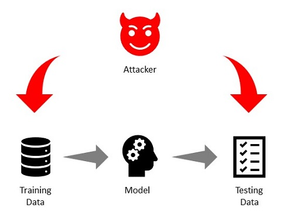
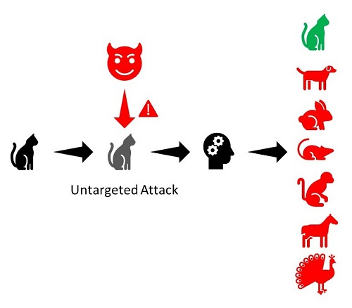
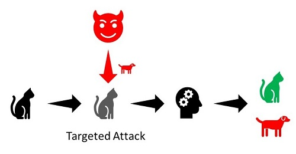
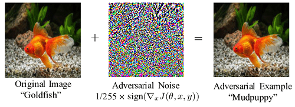
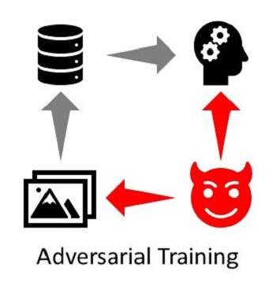
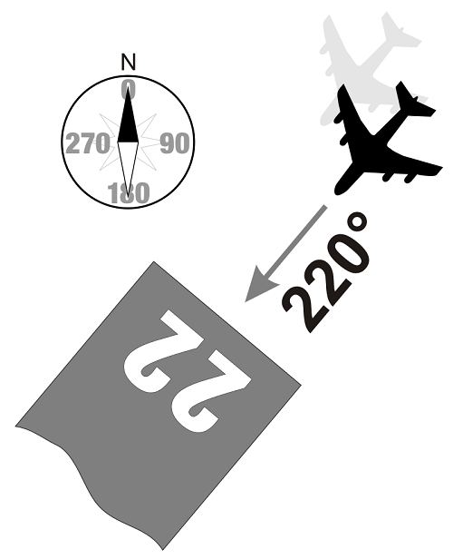

# ML/AI CoP Adversarial Attacks Tutorial

## Motivating Example - Runway Numbers

Suppose that we are tasked with developing a computer vision algorithm for detecting runway numbers in images to aid pilots during landing.  Great!  We'll just collect some images of runway numbers, split our data into train and test sets, train a deep neural network, test the model on our test set, and we're done!

Unfortunately for us, though fortunate for pilots and passengers, we have more work to do in order to deliver a system that is safe enough to fly.  We need to make sure that our algorithm is **robust** to errors and noise so that it can be trusted to behave predictably.  We will approach the problem of robustness from the perspective of **adversarial examples** or **attacks**.

## What are adversarial attacks/examples?

Put simply, adversarial attacks are inputs to a machine learning model where the expected output seems obvious to a human, but where the model is fooled into an incorrect output.  Examples include injecting words into email to avoid spam filters, adding noise to an image, and adding noise or sounds to audio.  In this tutorial we will be concerned with adversarial attacks on simple models for computer vision.  Here are a few famous examples:

Adding a small amount of noise causes the model to classify a panda as a gibbon. [1](#f1)

Modifying a single pixel causes misclassification.  Correct classes are black, incorrect classes are blue.  [2](#f2)

Adding a sticker caused the MobileEye camera on a Tesla Model S to predict a speed limit of **85** mph.  [3](#f3)

Wearing the right pattern makes a person invisible to a classifier.  [4](#f4)

It is important to note that even though adversarial examples are typically presented as intentional acts by an attacking agent, the same behaviors can be elicited by random noise as is most obvious in the cases above where single pixel changes cause erroneous outputs.  Robust algorithms should be capable of predictable behavior regardless of the source of the problematic data.  We will continue discussing deliberate attack and defense strategies, but keep this notion in mind.

## Taxonomy of attacks

There are a few dimensions upon which adversarial attacks can be classified.  The following are some of them, although the list is neither complete, nor exhaustive.

### Model Access

An attacker can have different levels of access to the model they are attacking.

1. **White Box Attacks**: The attacker has access to the full model.
2. **Black Box Attacks**: The attacker only has access to queries to input into the model and the results.  They do not know the model.
3. **Gray Box Attacks**: The attacker knows what model they are attacking and uses a virtual model and white box attacks.

The adversaries knowledge. (image source: [https://secml.github.io/class1/](https://secml.github.io/class1/))

### Dataset Access

Attacks can be classified by which datasets the attacks are injected into.

1. **Attacks in the Training set**: The attacker injects malicious data into the training set.
2. **Attacks in the Test set**:  The attacker injects malicious data into the test set.

### Targeted vs. Untargeted

Another way to understand adversarial attacks is by whether they are targeted or not.

1. **Untargeted Attacks**:  The goal is for the model to output an incorrect result from the attack input.  It does not matter what the actual result is as long as it differs from the correct one.

2. **Targeted Attacks**:  The goal is to get the model to output a particular incorrect result due to the attack input.

## Example Attack

[Here](https://github.com/Trusted-AI/adversarial-robustness-toolbox/wiki/ART-Attacks) is a large list of attacks implemented in ART along with references to the papers where they were introduced.

We will briefly familiarize ourselves with one of the first attacks from the literature, the *Fast Gradient Sign Method* (FGSM).  [5](#f5)  The FGSM is a white box attack that uses the gradients of the model being attacked to create adversarial examples.  In particular

    
        x' = x + &epsilon; * sign(&nabla;x J(&theta;, x, y))
    

where

* x': The desired adversarial example
* x : The original input
* y : The original output
* &epsilon; : A multiplier to scale perturbations
* &theta; : The model parameters
* J : The loss function

The basic idea is to use the gradients of the loss with respect to the input image to add small perturbations to the original image to maximize that loss.  Note that the model is already trained so the parameters, &theta;, are fixed in the calculation of the loss.  FGSM is simple and fast.  We will implement a FGSM attack in the tutorial.

## Example Defense

[Here](https://github.com/Trusted-AI/adversarial-robustness-toolbox/wiki/ART-Defences) is a list of defenses implemented in ART.

The simplest and one of the first defenses is **adversarial training**.  The idea is to augment the training data with adversarial examples generated from the attack.

## Another Layer of Protection - Monitoring

Although we have improved the robustness of our model to adversarial examples there are reasons to remain skeptical about the safety of our algorithm.

* It is not clear that the *training -> attacking -> retraining* cycle will ever converge to an equilibrium solution guaranteed to be "safe" from FGSM attacks.
* FGSM is only one out of many known attacks, and it is quite likely unknown attacks exists.  Using adversarial training for every possible attack is not feasible.
* We believe we have increased the likelihood that the results of our algorithm are more predictable, however, since our model is not particularly explainable we may have difficulty assuring a certifying organization that the model can be trusted.
* What other concerns can you raise?

There are many additional techniques that we can use to further improve the safety of our algorithm.  Here is a short, and not at all complete, list of techniques.

* Formal methods - We could provide mathematical proof for the behavior of our algorithm.  Typically not (currently) possible with more ML methods.
* Monitors - If we have knowledge of appropriate limits to the behavior of a system we can provide monitors that alert us to misbehavior.
* Redundancy - We can create multiple subsystems that do the same task, or are copies, and aggregate their outputs in some way to increase the likelihood that they are correct.
* Coverage - If we can guarantee that we have covered every possible input and the algorithm provides the correct output, then we have covered the entire behavior of the system.  This is typically not possible as the space of input/output pairs tends to be very large.

For this tutorial we'll choose to create a simple monitor.  Runway numbers are two digit numbers indicating the runway's heading in decadegrees (10 degrees per decadegrees) with 36 indicating north, 09 east, and so forth.  If there are parallel runways at an airport, there can be an additional letter **L**eft, **R**ight, or **C**enter indicating its position.  We'll ignore parallel runways in our example.

A diagram of a runway with a heading of 220 degrees from North.  [6](#f6)

Using this information, we will wrap the output of our runway number detection algorithm in a monitor that makes sure that the output is a number between 01 and 36.

## Additional Resources

There are many types of adversarial attacks on virtually every system built by humans.  Machine learning is by no means safe from adversarial attacks.  There are many resources for learning about attack types, methods, and defenses including:

* [Wikipedia](https://en.wikipedia.org/wiki/Adversarial_machine_learning)
* [OpenAI](https://openai.com/blog/adversarial-example-research/)
* [Adversarial Robustness Toolbox](https://github.com/Trusted-AI/adversarial-robustness-toolbox)  **\*We'll use this in the tutorial!**
* [DeepMind x UCL Course](https://youtu.be/MhNcWxUs-PQ)
* [NIST Taxonomy and Terminology](https://nvlpubs.nist.gov/nistpubs/ir/2019/NIST.IR.8269-draft.pdf)
* [Google Scholar](scholar.google.com) for many of the original papers.

## Hands-on

## References

<b id="f1">[1]</b> Ian J. Goodfellow, Jonathon Shlens, & Christian Szegedy. (2015). Explaining and Harnessing Adversarial Examples. [↩](#a1)

<b id="f2">[2]</b> Su, J., Vargas, D., & Sakurai, K. (2019). One Pixel Attack for Fooling Deep Neural Networks. IEEE Transactions on Evolutionary Computation, 23(5), 828–841. [↩](#a2)

<b id="f3">[3]</b> https://www.mcafee.com/blogs/other-blogs/mcafee-labs/model-hacking-adas-to-pave-safer-roads-for-autonomous-vehicles/ [↩](#a3)

<b id="f4">[4]</b> Simen Thys, Wiebe Van Ranst, & Toon Goedemé. (2019). Fooling automated surveillance cameras: adversarial patches to attack person detection. [↩](#a4)

<b id="f5">[5]</b> Goodfellow, I. J., Shlens, J., & Szegedy, C. (2014). Explaining and harnessing adversarial examples. arXiv preprint arXiv:1412.6572.   [↩](#a5)

<b id="f6">[6]</b> https://www.radarbox.com/blog/what-do-runway-numbers-mean [↩](#a6)